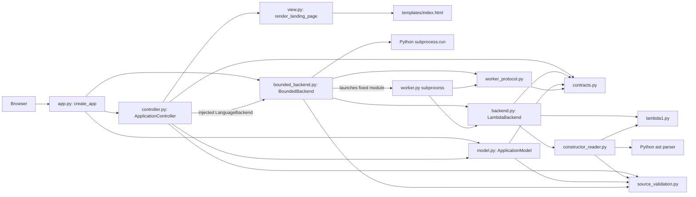

# Architecture

## Current components (Step 6)

This is the implemented dependency graph for the default composition. The app
injects an independent model and bounded backend into its controller. Source and
action routes return state/result JSON; the landing view stays static until Step 7.

| Responsibility | Implementation | Current status |
| --- | --- | --- |
| Composition | `lambda_web/app.py`, `create_app` | Injects model/backend, registers routes/errors, waits for work at shutdown |
| Controller | `lambda_web/controller.py`, `ApplicationController` | Handles sources/actions, coordinates model/backend, returns snapshots/results |
| View | `lambda_web/view.py`, `templates/index.html` | Static markup without language analysis |
| Model | `lambda_web/model.py`, `ApplicationModel` | Source/revision, editing, busy, and result rules |
| Backend adapter | `lambda_web/backend.py`, `LambdaBackend` | Real Lint/Interpret and explicit unavailable operations |
| Bounded adapter | `lambda_web/bounded_backend.py`, `BoundedBackend` | Five-second workers, cleanup, and failure results |
| Worker/transport | `lambda_web/worker.py`, `worker_protocol.py` | Restricted language processing and validated JSON results |
| Shared contracts | `lambda_web/contracts.py` | Protocol, operations, outcomes, results, future artifact |
| Constructor reader | `lambda_web/constructor_reader.py` | Validated AST traversal and 64 KiB text bound |
| Shared source validation | `lambda_web/source_validation.py` | Encoding, nonempty text, and 64 KiB bound without parsing |
| Language tools | `lambda_web/lambda1.py` | Supplied implementation, unchanged |

## Backend contract

`LanguageBackend` is a structural Python protocol. A replacement implements:

- `lint(source, source_revision) -> OperationResult`
- `interpret(source, source_revision) -> OperationResult`
- `typecheck(source, source_revision) -> OperationResult`
- `compile(source, source_revision) -> OperationResult`
- `execute(artifact_or_none, source_revision) -> OperationResult`

`OperationResult` is immutable and contains `operation`, `source_revision`,
`outcome`, and textual `output`. Optional `free_variables` is a Python
`frozenset[str]` for a completed Lint analysis; optional `artifact` is always
`None` in the current implementation. Model state guards validate that
source is applied and requests are allowed; the adapter owns language processing.

| Outcome | Meaning |
| --- | --- |
| `success` | No free variables or a successful interpreter value |
| `invalid_input` | Source encoding/size/emptiness, constructor syntax, or argument errors |
| `language_error` | Lint found undeclared variables |
| `runtime_error` | Evaluation arithmetic/type/value/recursion error or exact `D0V000()` in a value/pair |
| `backend_failure` | Unexpected reader/tool failure or invalid tool return |
| `not_implemented` | Type-check or Compile placeholder; no claimed analysis/artifact |
| `unavailable` | Execute cannot execute generated code in this implementation |

Lint calls `d0exp_fvset`, checks its `frozenset` result, and lists names in sorted
order. It never evaluates source. Interpret calls `d0exp_evaluate` with `ENVnil()`
without requiring Lint. Returned values are formatted as text. Sentinel detection
uses exact type equality because all successful values inherit from `D0V000`.
The language implementation has no HTTP/view/model dependencies. The bounded
adapter runs it inside a disposable worker; direct `LambdaBackend` calls are
reserved for worker execution and language tests.

## Bounded execution

`BoundedBackend` preserves the synchronous backend interface. It checks source
transport limits, launches a fixed Python module without a shell, and sends source
as UTF-8 JSON on stdin. The worker runs the existing reader/Lint/Interpret code.
JSON responses are checked for operation/revision, outcome, output, free variables,
and absence of artifacts. No uploaded Python is executed.

`subprocess.run(timeout=5)` bounds startup/imports, parsing, evaluation, and result
transport after OS process creation; process creation overhead and cleanup can
extend total elapsed time. Python kills and waits for timed-out children and closes
pipe handles. Timeouts and worker/transport failures return `backend_failure`;
normal language diagnostics retain their original outcomes. Placeholder methods
run in-process without workers. The controller uses `asyncio.to_thread` and shields
its owned task from HTTP-wait cancellation. Cleanup belongs to the worker thread:
busy state persists until completion, even if the requesting client disconnects.
Shutdown waits for owned tasks. The event loop remains available for state requests;
model guards reject conflicting edits/actions. These HTTP behaviors are tested.

## Model state and transitions

`ApplicationState` is an immutable snapshot: applied source/name, draft/name,
revision, result tuple, optional artifact (always absent here), and active operation.
Dirty means draft text differs from applied text; busy means an operation is active.

Accepted uploads/canned loads and applied edits create a revision and clear
results/artifacts. Manual input opens a blank draft; Apply accepts it and Discard
restores applied text/name. Rejected changes preserve source/revision/results;
invalid text remains editable. Transport validation is shared without importing
language tools into the model. Syntax is checked only by the backend reader.

Short locked transitions reject dirty/busy conflicts and atomically start work.
`begin_operation` returns an `OperationRequest`; `finish_operation(request, result)`
requires the same active request, operation, and revision. Invalid completions leave
state unchanged. `abort_operation(request)` is idempotent and cannot clear newer
work, so the controller can use it for cleanup. Failed backend results preserve
source and allow retry. The model never calls a backend or accesses a local file.
Generated artifacts are reserved but rejected in this version; Execute is blocked.

## Load -> Lint -> Interpret trace

The following HTTP/model/backend trace is implemented. Browser controls and
literal result rendering will connect to these responses in Step 7.

1. Upload/canned routes load decoded text, or draft/Apply routes accept an edit.
   The model creates a revision and clears old results/artifacts. Rejection
   preserves applied state; empty/rejected edits remain correctable. Invalid
   UTF-8/oversized uploads keep the existing draft. Upload replacement is checked
   before reading and again when accepting source to prevent races with edits.
2. On `POST /api/actions/lint`, the model atomically checks prerequisites and
   starts work. The controller passes applied text/revision to the adapter in a
   thread. Reader builds the expression; `d0exp_fvset` finds free variables.
3. A closed expression returns success. `D0Evar("x")` returns `language_error`
   listing `x`; controller stores the revision-associated result for the view.
4. Interpret is independent. Reader builds the applied expression again and the
   evaluator uses an empty environment. `D0Evar("x")` yields `D0V000()` and a
   `runtime_error`. Closed division by zero also fails despite passing Lint.
5. Controller validates the backend result and stores it through the model using
   the original request. Unexpected failures become `backend_failure`. Completion
   releases busy state and permits retry; applied source remains intact.
6. Action responses return state and result with action/revision/outcome/text.
   `GET /api/state` reports busy status, results, and enabled actions. The future
   browser view will display these literal values; Execute remains unavailable.

## Design decisions

1. FastAPI with plain HTML/CSS/JavaScript gives explicit HTTP boundaries and easy
   controller testing, at the cost of keeping browser/server state synchronized.
2. Controller-coordinated tools keep the model independent of language execution,
   at the cost of orchestration and cleanup in the controller. Shared contracts
   live separately so the future model need not import the concrete interpreter.

## Future tools and generated artifacts

Real type-checking and compilation could replace the adapter methods without
changing view code or state ownership. `GeneratedArtifact` defines immutable
`source_revision`, textual `code`, and `code_format` identifying the execution
format. A real compiler would return it with a successful compilation result.
The model would associate it with the current source, invalidate it on source
changes or failed recompilation, and enable Execute only when usable code exists.
Execute would consume the stored artifact without silently recompiling. A future
executor must validate revision/format and use bounded execution.

Current Compile creates no artifact. Current Execute always returns unavailable,
even if passed a hypothetical artifact, because generated-code execution is out
of scope. No compiler, mock compiler fixture system, or executor is implemented.
