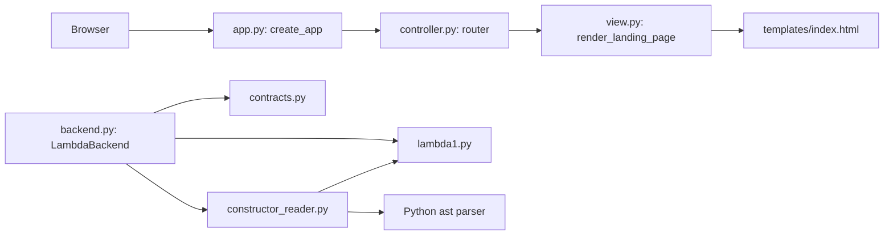

# Architecture

## Current components (Step 3)

This is the implemented dependency graph. Backend operations can be called
independently, but the HTTP controller still serves only the landing page.
`model.py` remains a reserved boundary; state rules are scheduled for Step 4.

| Responsibility | Implementation | Current status |
| --- | --- | --- |
| Composition | `lambda_web/app.py`, `create_app` | Creates FastAPI and registers routes |
| Controller | `lambda_web/controller.py`, `landing_page` | Requests the landing view; tool dispatch pending |
| View | `lambda_web/view.py`, `templates/index.html` | Static markup without language analysis |
| Model | `lambda_web/model.py` | Reserved for source, revisions, and state rules |
| Backend adapter | `lambda_web/backend.py`, `LambdaBackend` | Real Lint/Interpret and explicit unavailable operations |
| Shared contracts | `lambda_web/contracts.py` | Protocol, operations, outcomes, results, future artifact |
| Constructor reader | `lambda_web/constructor_reader.py` | Validated AST traversal and 64 KiB text bound |
| Language tools | `lambda_web/lambda1.py` | Supplied implementation, unchanged |

## Backend contract

`LanguageBackend` is a structural Python protocol. A replacement implements:

- `lint(source, source_revision) -> OperationResult`
- `interpret(source, source_revision) -> OperationResult`
- `typecheck(source, source_revision) -> OperationResult`
- `compile(source, source_revision) -> OperationResult`
- `execute(artifact_or_none, source_revision) -> OperationResult`

`OperationResult` is immutable and contains `operation`, `source_revision`,
`outcome`, and textual `output`. Optional `free_variables` is a Python
`frozenset[str]` for a completed Lint analysis; optional `artifact` is always
`None` in the current implementation. Model state guards will validate that
source is applied and requests are allowed; the adapter owns language processing.

| Outcome | Meaning |
| --- | --- |
| `success` | No free variables or a successful interpreter value |
| `invalid_input` | Source encoding/size/emptiness, constructor syntax, or argument errors |
| `language_error` | Lint found undeclared variables |
| `runtime_error` | Evaluation arithmetic/type/value/recursion error or exact `D0V000()` in a value/pair |
| `backend_failure` | Unexpected reader/tool failure or invalid tool return |
| `not_implemented` | Type-check or Compile placeholder; no claimed analysis/artifact |
| `unavailable` | Execute cannot execute generated code in this implementation |

Lint calls `d0exp_fvset`, checks its `frozenset` result, and lists names in sorted
order. It never evaluates source. Interpret calls `d0exp_evaluate` with `ENVnil()`
without requiring Lint. Returned values are formatted as text. Sentinel detection
uses exact type equality because all successful values inherit from `D0V000`.
The adapter has no HTTP/view/model dependencies and has no execution timeout yet.

## Load -> Lint -> Interpret trace

The application-level trace below is the intended flow; loading/state/controller
integration is not implemented yet. The language-operation steps are implemented.

1. Controller asks the model to accept source, create a revision, and clear old
   results/artifacts; rejected changes preserve applied state.
2. On Lint, controller checks model prerequisites and passes applied text/revision
   to the adapter. Reader builds the expression; `d0exp_fvset` finds free variables.
3. A closed expression returns success. `D0Evar("x")` returns `language_error`
   listing `x`; controller stores the revision-associated result for the view.
4. Interpret is independent. Reader builds the applied expression again and the
   evaluator uses an empty environment. `D0Evar("x")` yields `D0V000()` and a
   `runtime_error`. Closed division by zero also fails despite passing Lint.
5. Controller stores the result through the model; view displays action, revision,
   outcome, and literal text. Busy handling and bounded work follow in later steps.

## Design decisions

1. FastAPI with plain HTML/CSS/JavaScript gives explicit HTTP boundaries and easy
   controller testing, at the cost of keeping browser/server state synchronized.
2. Controller-coordinated tools keep the model independent of language execution,
   at the cost of orchestration and cleanup in the controller. Shared contracts
   live separately so the future model need not import the concrete interpreter.

## Future tools and generated artifacts

Real type-checking and compilation could replace the adapter methods without
changing view code or state ownership. `GeneratedArtifact` defines immutable
`source_revision`, textual `code`, and `code_format` identifying the execution
format. A real compiler would return it with a successful compilation result.
The model would associate it with the current source, invalidate it on source
changes or failed recompilation, and enable Execute only when usable code exists.
Execute would consume the stored artifact without silently recompiling. A future
executor must validate revision/format and use bounded execution.

Current Compile creates no artifact. Current Execute always returns unavailable,
even if passed a hypothetical artifact, because generated-code execution is out
of scope. No compiler, mock compiler fixture system, or executor is implemented.
