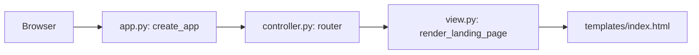
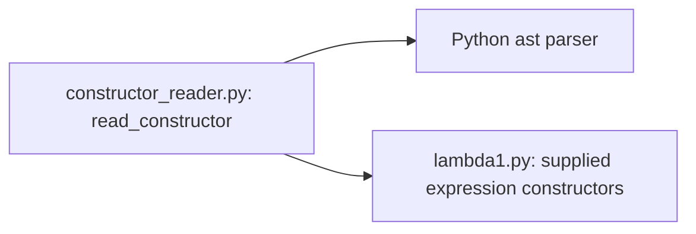

# Architecture

## Current components (Step 2)

This is the actual dependency graph for the landing page. The model and backend
modules still declare boundaries only. The separate restricted reader now
constructs expressions, but MVC state and language operations are not connected. `lambda1.py` is the verbatim supplied language module.

| Responsibility | Implementation | Current status |
| --- | --- | --- |
| Composition | `lambda_web/app.py`, `create_app` | Creates FastAPI and registers routes |
| Controller | `lambda_web/controller.py`, `landing_page` | Handles GET / and requests the view |
| View | `lambda_web/view.py` and `templates/index.html` | Returns static markup without analysis |
| Model | `lambda_web/model.py` | Reserved; source and state rules follow in Step 4 |
| Backend adapter | `lambda_web/backend.py` | Reserved; operations follow in Step 3 |
| Constructor reader | `lambda_web/constructor_reader.py`, `read_constructor` | AST whitelist, field validation, and 64 KiB input bound |
| Supplied language tools | `lambda_web/lambda1.py` | Copied unchanged; not exposed to requests |

## Implemented reader dependency

This reader is independent of the HTTP/view/model modules. `validate_source`
checks text encoding, size, and emptiness without parsing. `read_constructor`
additionally validates the AST and returns one expression, or raises
`ConstructorInputError`. It performs no free-variable analysis or evaluation.
The adapter will call the reader in Step 3; this dependency is not wired yet.
Only concrete supplied expression constructors are allowlisted. AST nodes are
walked as data, never compiled into executable Python code.

## Chosen direction

The controller will coordinate the model and a replaceable backend. The model
will enforce source/revision, draft, busy, result, and artifact invariants without
HTTP or browser dependencies. The view will forward interactions and render
returned state, without parsing or interpreting source.

1. FastAPI with plain HTML/CSS/JavaScript: explicit HTTP boundaries and test
   backend substitution, at the cost of keeping browser and server state in sync.
2. Controller-coordinated language operations: leaves the model independent of
   language execution, at the cost of orchestration and cleanup in the controller.

## Contract and traces to complete

Later steps will document the implemented Load -> Lint -> Interpret trace,
including undeclared variables, and update the diagram to match real dependencies.
Results will include operation, source revision, outcome, and textual output.
Outcomes will distinguish success, invalid input, language/runtime errors,
backend failures, not implemented, and unavailable.

A future compiler adapter could return generated code with its format and source
revision; the model would invalidate it on source changes or failed recompilation.
Execute would consume that artifact without recompiling. This assignment will
implement neither a compiler nor generated-code execution.
