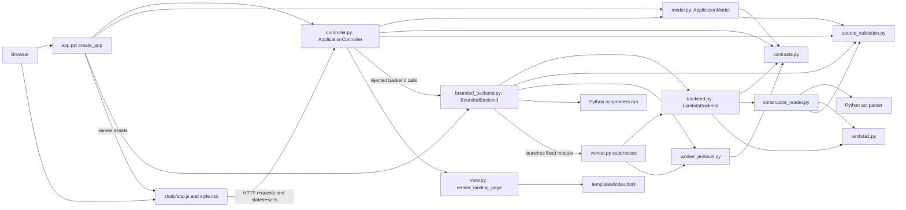

# Architecture

## Components and responsibilities

Arrows show imports, injected collaborators, and labeled runtime interactions.
The app creates independent model/controller instances and injects a
`LanguageBackend`; the diagram shows the default bounded implementation.

| Responsibility | Implementation | Owns |
| --- | --- | --- |
| Composition | `app.py: create_app` | Injection, routes, static files, error handlers, shutdown |
| Model | `model.py: ApplicationModel/ApplicationState` | Source/draft, revision, results/artifact, state rules |
| Controller | `controller.py: ApplicationController` | Source requests, tool dispatch, completion, JSON snapshots |
| View | `view.py`, `templates/index.html`, `static/app.js`, `static/style.css` | Controls, editing, status, literal results |
| Language adapter | `backend.py: LambdaBackend` | Supplied free-variable analysis/evaluation and diagnostics |
| Bounded adapter | `bounded_backend.py: BoundedBackend` | Worker timeout and failure handling |
| Worker/transport | `worker.py`, `worker_protocol.py` | Trusted processing and validated JSON |
| Shared contracts | `contracts.py` | Protocol, operations, outcomes, results, future artifact |
| Input validation | `constructor_reader.py`, `source_validation.py` | Restricted constructor AST; nonempty UTF-8/64 KiB checks |
| Language | `lambda1.py` | Supplied implementation, unchanged |

All Python module paths above are relative to `lambda_web/`. The model imports
neither HTTP nor language tools. The view forwards interactions and renders state
without parsing, linting, or interpreting source.

## Backend contract

The synchronous structural protocol defines `lint`, `interpret`, `typecheck`,
and `compile` with `(source: str, source_revision: int)`, plus
`execute(artifact: GeneratedArtifact | None, source_revision: int)`.
Each returns immutable `OperationResult`: operation, source revision, outcome,
text output, optional `frozenset[str]` free variables, and optional artifact.
Artifacts are always absent in this implementation.

| Outcome | Meaning |
| --- | --- |
| `success` | Closed Lint analysis or successful evaluation |
| `invalid_input` | Constructor syntax/arguments or source transport error |
| `language_error` | Undeclared variables |
| `runtime_error` | Evaluation failure or exact error sentinel |
| `backend_failure` | Timeout, worker/transport failure, unexpected exception/invalid result |
| `not_implemented` | Type-check/Compile placeholder |
| `unavailable` | Backend Execute has no implemented generated-code executor |

Lint calls `d0exp_fvset`, returns its `frozenset`, and sorts undeclared names;
it never evaluates source. Interpret independently calls `d0exp_evaluate` with
`ENVnil()`. Exact `D0V000()` values directly or inside pairs are runtime errors.
Exact type comparison matters because successful values inherit from `D0V000`.

HTTP actions return state/result JSON, including operation/revision/outcome.
Source rejection is HTTP 400, model conflict 409, and malformed request 422;
language outcomes use HTTP 200. Execute is disabled and rejected by the model
before backend dispatch. Neither placeholder parses source or creates artifacts.

## State, synchronization, and bounded work

Accepted loads/applied edits increment revision and clear results/artifacts.
Discard restores applied text/name without changing revision/results. Rejection
preserves applied state and keeps rejected text correctable; undecodable or
oversized uploads keep the existing draft. Dirty state blocks tools/replacement;
busy state also blocks editing, Apply, and Discard.

Short locked model transitions atomically start work. Completion must match the
original `OperationRequest`, operation, and revision. Cleanup cannot clear newer
work. The controller validates/stores results and converts unexpected failures
to `backend_failure`, preserving source and enabling retry.

The browser serializes draft requests and preserves newer typing over older
responses. Apply waits for synchronization. Local control guards reflect state;
the model independently enforces its rules. Textarea values and DOM text nodes
render source/results literally, with `pre` preserving output line breaks.

The controller waits using `asyncio.to_thread`, shielding owned work from HTTP
cancellation and awaiting it at shutdown. The bounded adapter launches a fixed
trusted worker without a shell and sends source as JSON, never executable Python.
Its five-second timeout covers startup through response after OS process creation;
creation/cleanup can add overhead. Timed-out workers are killed and waited for.
The event loop stays responsive. Lost responses trigger state refresh and, when
busy, polling until completion. No persistence or multi-tab synchronization exists.

## Load → Lint → Interpret trace

1. Browser upload/canned or draft/Apply requests reach the controller. Uploads
   are decoded as UTF-8; replacement permission is checked again after reading.
   The model accepts source, creates revision N, and clears previous results.
2. Lint starts an owned model request. The controller passes applied source/N to
   the backend in a thread. The worker reader constructs the expression;
   `d0exp_fvset` computes free variables.
3. Closed source yields success. `D0Evar("x")` yields `language_error` listing
   `x`. The controller records the matching result, releases busy state, and
   returns it for the view to display.
4. Interpret starts independently, parsing the applied source again and using an
   empty environment. `D0Evar("x")` yields an error sentinel and
   `runtime_error`; closed division by zero also fails despite passing Lint.
5. The model records the result for N, preserves source, and allows another action.
   The view shows action, revision, outcome, and literal output.

## Two design decisions

1. FastAPI with plain HTML/CSS/JavaScript makes HTTP boundaries and controller
   testing explicit. The tradeoff is manually synchronizing drafts and controls.
2. Controller-coordinated tools keep state rules independent of language
   execution. The tradeoff is controller responsibility for orchestration,
   result validation, and asynchronous cleanup.

## Future tools and generated artifacts

A real type checker can replace its adapter method while retaining result
metadata and view code. A compiler also needs changes to the current model and
controller validation, which reject artifacts. `GeneratedArtifact` defines
`source_revision`, textual `code`, and `code_format`. Successful compilation
would store this artifact; source changes or failed recompilation would invalidate
it. Execute would consume the stored artifact without silently recompiling,
checking revision/format and using bounded execution.

This is a future design, not implemented functionality. Compile currently
returns `not_implemented`; no compiler, compiler fixture system, or generated-code
executor was added.
