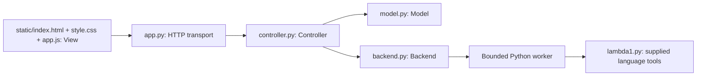

# Architecture

| Responsibility | Implementation |
| --- | --- |
| Model | `Model.apply`, `begin`, `finish`: source, revision, results, busy state, artifact invalidation and preconditions |
| View | HTML/CSS presentation; JavaScript draft, control enablement, literal rendering and request forwarding |
| Controller | `Controller.apply/run`: serialize state changes, dispatch backend operations, restore state after failures |
| HTTP adapter | `Handler`: decode JSON, enforce request bounds, serve static assets; no evaluation logic |
| Language adapter | `read_source`, `perform`, `Backend.run`: constructor validation, real lint/evaluation, subprocess bounds |

## Load → Lint → Interpret

1. Browser loads an editable example from `/api/examples` and posts it to `/api/source`.
2. Controller asks Model to apply it. Nonempty source within the byte limit becomes a new revision. Results and artifacts clear; rejected updates leave the previous source intact.
3. Lint posts `/api/action`. Model requires applied source and idle state, then enters busy state. Controller snapshots source and invokes the adapter outside its lock.
4. The worker constructs the expression from validated Python AST nodes and calls `d0exp_fvset`. An empty frozenset yields success. Nonempty sets yield a language error with sorted variable names, without evaluation.
5. Controller attaches operation and source revision to the result and restores idle state. View displays text literally.
6. Interpret independently repeats the dispatch but calls `d0exp_evaluate(expr, ENVnil())`. Lint success is not required. Undeclared variables may return an error sentinel; direct or pair-nested sentinels are runtime errors. Exceptions such as division by zero are also runtime errors.

## Adapter contract

`Backend.run(operation, source)` returns `{outcome, text}`. Outcomes are `success`, `input_error` (invalid constructor syntax/arguments), `language_error` (free variables), `runtime_error` (evaluation failure), `backend_error` (worker failure/timeout), and `not_implemented`. Controller stores `{operation, revision, outcome, text}`. Source revision cannot change during an operation. Requests during busy state are rejected. Unexpected adapter exceptions become backend errors and leave source available for retry.

Type-check and Compile return `not_implemented`, never success or an artifact. Execute is rejected at the model boundary and disabled in the view. A future artifact contract should include `{revision, format, payload, producer_version}`. A real compiler must return a validated artifact for the active revision; Execute must consume it directly without recompilation. Source changes and failed compilation invalidate it. Execution requires a separate bounded adapter appropriate to the artifact format; never run arbitrary uploaded code as an artifact.

## Decisions and tradeoffs

* Standard-library HTTP server and explicit modules keep setup dependency-free and make MVC boundaries visible. This deliberately targets one local user/tab rather than production sessions, authentication, or distributed state.
* Separate worker processes provide enforceable execution bounds and protect server responsiveness at the cost of process startup overhead. A browser draft avoids per-keystroke HTTP requests but is lost on refresh if the user ignores the unsaved-edit warning. Applied source lasts only for the server process lifetime.
